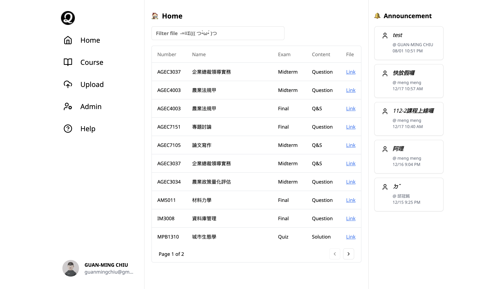

# Quiztory 📚

<p align="center">
  
</p>


- We have created a platform dedicated to sharing and downloading exam materials. On this website, users can:

    **Upload exam materials** - Have extra exam materials? Share them here with those in need.

    **Download exam materials** - Check available exam materials for your courses.

    **Manage course materials** - Administrators can manage courses and files to ensure quality and relevance.

- **Deployed link:** [Quiztory - Exam Material Sharing Platform](https://quiztory.vercel.app/)

### 📚 Feature Introduction

- **Users:**
    - Google OAuth2.0 login
    - Update personal profile
    - User statistics (number of uploads / number of downloads)
- **Files:**
    - List all files and filter by type
    - Display course and exam type for each file
    - Support for uploading PDF files and adding descriptions
    - Delete and edit files
- **Courses:**
    - Browse all courses
    - View files for specific courses
- **Administrators:**
    - Manage courses and files
    - Create announcements
    - View user activity
- **Interface:**
    - Responsive design
    - File preview

### 📚 Frameworks / Modules / Third-Party Packages Used

#### Frontend:
- React.js, Next.js
- UI components: shadcn-ui, lucide-react
- Authentication: next-auth
- File upload: @uploadthing/react

#### Backend:
- Next.js API Routes
- Database operations: drizzle-orm, drizzle-zod
- Database: @vercel/postgres, pg

#### Development Tools:
- Code formatting and linting: eslint, prettier, @trivago/prettier-plugin-sort-imports, prettier-plugin-tailwindcss
- Type checking: typescript

### 📚 How to Install and Test on Localhost

1. Clone this repository:
   ```
   git clone https://github.com/guan404ming/quiztory.git
   cd quiztory
   ```

2. Install dependencies:
   ```
   yarn install
   ```

3. Set up environment variables:
   - Copy the `.env.example` file to create a new `.env.local` file:
     ```
     cp .env.example .env.local
     ```
   - Open the `.env.local` file and fill in the necessary environment variables (e.g., database URL, API keys, etc.)

4. Run the development server:
   ```
   yarn dev
   ```

5. Open [http://localhost:3000](http://localhost:3000) with your browser to see the result.

### 📚 Deployment

This project is deployed using Vercel. Check out our [Next.js deployment documentation](https://nextjs.org/docs/deployment) for more details.

### 📚 Contributing

Pull requests are welcome. For major changes, please open an issue first to discuss what you would like to change.

### 📚 License

[MIT](https://choosealicense.com/licenses/mit/)
